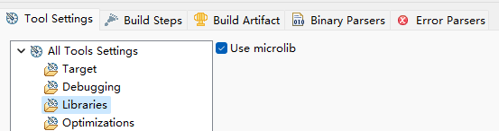
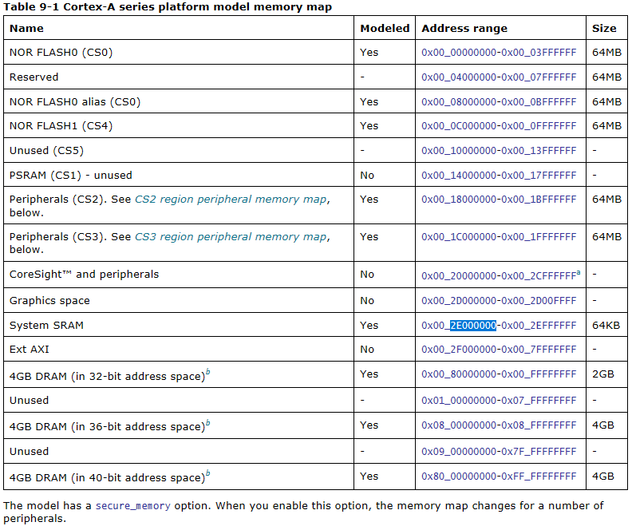
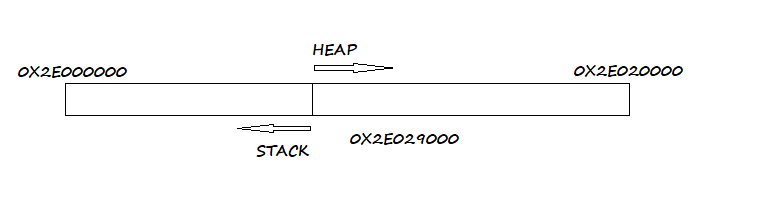
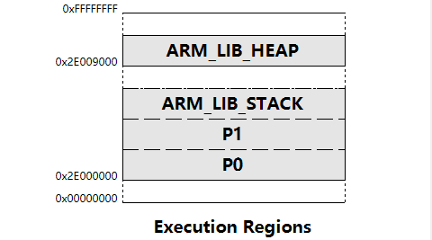
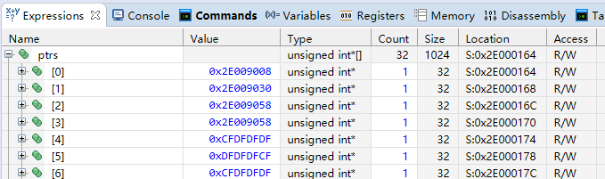
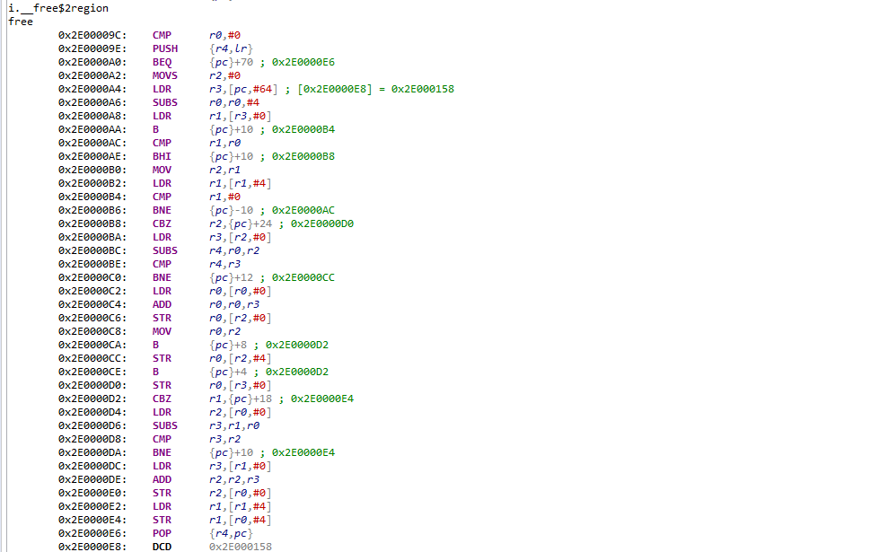
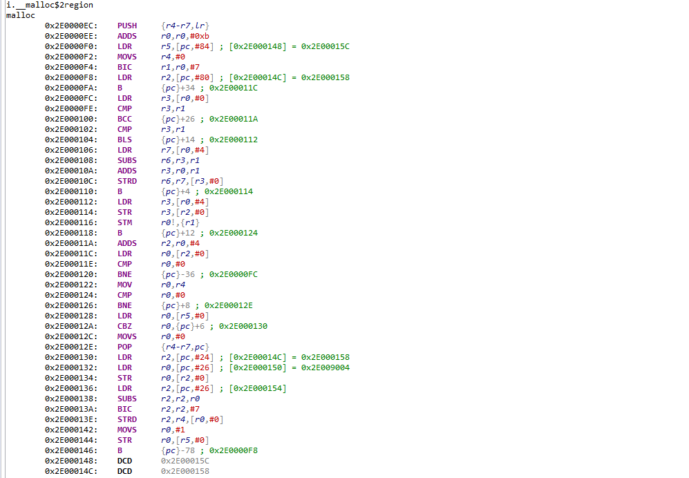

本文任务：为陌生的SoC平台编写基础软件，适配 `malloc()` 函数
## 0 如何为SoC做ARM CPU适配
今时不同往日，我们平时开发/娱乐接触到的消费级MCU/MPU基本山都是包含处理核与一系列外设的SoC。如果熟悉裸片开发，一定会在厂家提供的标准库或者SDK包里找到命名类似 `startup.s` 的汇编文件；如果熟悉 `Linux` 移植，则不难联想到 `arch/arm/kernel` 或者 `arch/arm/boot` 目录下也有类似的文件。

## 1 Start.s 是什么
startup.s 文件是引导程序的入口点，通常包含引导加载程序需要执行的初始化代码。这些代码负责设置堆栈、加载内核映像到内存中以及跳转到内核入口点。该文件中常见的内容包括：

- 中断向量和异常处理程序（**interrupt handlers**）：操作系统需要处理各种中断和异常情况，startup.s 文件通常包含中断向量表的定义和异常处理程序的初始化代码。它会设置和配置中断控制器，并将中断向量指向相应的处理函数。

- 硬件初始化（**init**）：startup.s 文件可能包含对硬件设备的初始化代码，例如启动时钟、初始化串口、启用内存管理单元（MMU）等。这些代码为操作系统提供了基本的硬件支持。

- 运行环境设置（**config**）：startup.s 文件可能包含设置运行环境所需的代码。例如，它可以设置执行状态，如处理器模式、特权级别等。还可能设置全局变量或数据结构来存储关键的运行时信息。

- 内核入口点（**entry point**）：最后，startup.s 文件通常将控制权传递给内核的入口函数。这个内核入口点是操作系统初始化的起点，它接收传递的参数和启动信息，并开始执行操作系统的初始化过程。

熟悉意法半导体的 STM32 微控制器的，就知道类似于中断向量表这些最最最最最基本的配置，一般都是放在 `startup.s` 里面的。宽泛地说，所有围绕 `startup.s` 文件开展的工作，就是芯片原厂需要做的 SoC 处理器软件适配，具体到ARM Cortex-A，则可以称作是 CPU软件适配。

## 2 需要考虑哪些问题？

### 2.1 提供 malloc 函数实现
既然目标在是在裸核上调用  `malloc()`，那首先得提供一个它的实现吧。

malloc 函数是 C 标准库中的动态内存分配函数。它用于在程序运行时从堆（Heap）中分配指定大小的内存块，并返回该内存块的起始地址。

使用 malloc 函数可以动态地分配内存，避免了在编译时静态地分配内存的限制。这对于需要在运行时根据需要分配或释放内存的情况非常有用。

malloc 函数的原型如下：

    
```c
void *malloc(size_t size);
```
参数 size 指定所需内存块的大小，以字节为单位。返回值是一个指向分配的内存块起始地址的指针，类型为 void*。如果分配失败，则返回 NULL。

`malloc`这种标准函数，处理器厂商都会提供专门优化的实现，比如 ARM 就针对 ARM 处理器提供买了MicroLib库。这是一个精简的 C 标准库，包含常见的标准库函数，例如内存分配和释放（通过 `malloc` 和 `free`）、字符串操作（例如 `strcpy` 和 `strlen`）以及输入输出函数（如 `printf` 和 `scanf`）。一般在IDE的工程属性设置中勾选包含即可。



### 2.2 提供入口点（entry point）
处理器上电以后从预定位置执行ROM程序，而后跳转到RAM上指定位置执行应用程序，虽然C程序的主流程在main函数中描述，但无论是ROM还是RAM,第一条指令都不是main的入口，那么就需要咱提供跳转到main函数的指令，形如：

```c
	.global main_app
	.balign 0x10
_reset:
	B	main_app
```
解析每条指令的含义如下：

`.global main_app`: 这是一个指令宏，用于声明 main_app 是一个全局标识符，该标识符可以在其他文件中引用。

`.balign 0x10`: 这是对齐指令，将下一个标签或指令地址对齐到 16 字节边界。这种对齐可能对于某些处理器或内存访问要求是必要的，例如某些 ARM 处理器可能需要特定的对齐方式以获得最佳性能。

`_reset:`: 这是一个标签，用于将 _reset 和下一个指令或数据相关联。标签可以用于跳转、调用或在汇编代码中创建有意义的位置。

`B main_app`: 这是无条件分支指令（Branch），将程序流转移到名为 main_app 的位置。B 指令将控制权直接跳转到指定的地址。

这段汇编代码的意图是：通过 _reset 标签将程序引导到 main_app 代码的入口点。在 _reset 处，执行一个无条件的分支指令 B，将控制权转移到 main_app 标签/符号（涉及编译原理）处的代码。

### 2.3 初始化堆栈指针
跳转到main函数的最终目的，是调用malloc函数，而arm处理器上执行函数调用势必发生压栈、出栈等堆栈操作，故而需要提前设置好堆栈，于是我们修改 `startup.s` 为：

```c
	.set stack_top, 0x2E009000
	.global main_app
.balign 0x10
_reset:
	ldr r3, =stack_top
	mov sp, r3
	B	main_app
```
`.set stack_top`, 0x2E009000: 这是一个宏定义，表示将标识符 stack_top 的值设置为 0x2E009000。在这里，stack_top 被用来表示栈顶的地址，即堆栈将会从这个地址开始增长。

`ldr r3, =stack_top`: 这条指令将 stack_top 的值加载到寄存器 r3 中。

`mov sp, r3`: 这条指令将 r3 中的值移动到堆栈指针寄存器 sp 中。
### 2.4 整个程序应该放在什么地方运行？
自然是RAM中啦，软件设计人员应该找系统设计人员要一张系统架构图/地址分配表，据之明确片上存储器的位置和存储容量，然后才能确定如何编写链接文件。

啥是链接文件啊？链接文件（Linker file），也称为链接脚本（Linker script）或连接器脚本，是用于指导链接器（Linker）如何将多个目标文件（Object file）组合在一起以生成可执行文件的文本文件。

我们目前的地址分配表是这样的：



可以看到 System RAM 的起始地址是`0x2E000000`，存储容量是64KB，这就是我们的程序在运行时所处的位置（不考虑更上层的Cache和寄存器）。大概划分一下用途，前面 `0x9000` 的空间用来放指令，从 `0x200E9000` 开始的空间则用作堆（heap），即 `malloc` 和 `free` 函数管理的空间。



对应的链接脚本可以写成：

```bash
LOAD_REGION 0x2E000000 0x10000
{
	P0 +0
    {
       start_up.o
    }
    P1 +0
    {
        *(+ro)
        *(+rw, +zi)
    }
    
    ARM_LIB_STACK	+0 ALIGN 8 EMPTY 0x1000 {}

    ARM_LIB_HEAP 0x2E009000 EMPTY 0x7000 ; Heap region growing up
    { }
}
```

可视化的效果为：

### 2.5 堆栈指针的初始值是怎么确定的？

原则就一句话——只要保证栈不会和堆或者代码段发生交叠（overlap）就行。这里我把栈放在代码段后面（`0x200E9000`之前），故而初始值设为:
```c
.set stack_top, 0x2E009000
```
## 3 怎么验证适配效果？
答案是不外乎仿真、实测、反汇编三板斧。
### 3.1 实测验证

前两个很明白，写个测试程序看看适配的函数行为是否符合预期就行，例如用下面这个程序测试  `malloc` 和 `free`：

```c
/*
 * author water cutter
 * */
#include <stdlib.h>

unsigned int* ptrs[32] = {0};
unsigned int allocByteNum = 1;

void main_app(){
	ptrs[0] = (unsigned int*)malloc(allocByteNum);
	ptrs[1] = (unsigned int*)malloc(allocByteNum);
	ptrs[2] = (unsigned int*)malloc(allocByteNum);
	free(ptrs);
	ptrs[3] = (unsigned int*)malloc(allocByteNum);
	while(1){ asm("nop"); }
}
```
比较ptrs[2]和ptrs[3]的值，一致则说明malloc和free功能正确（保证所有分配的地址都在堆空间范围内的前提下）：



### 3.2 通过反汇编检验
将 `.axf` 或者 `.out` 文件反汇编，在反汇编文件中找到对应的实现，分析确认其功能正确即可。

`free()` 的反汇编：

`malloc()` 的反汇编：

## 源码
源码仓库：[soc_port_method](https://github.com/WaterCutter/soc_port_method)